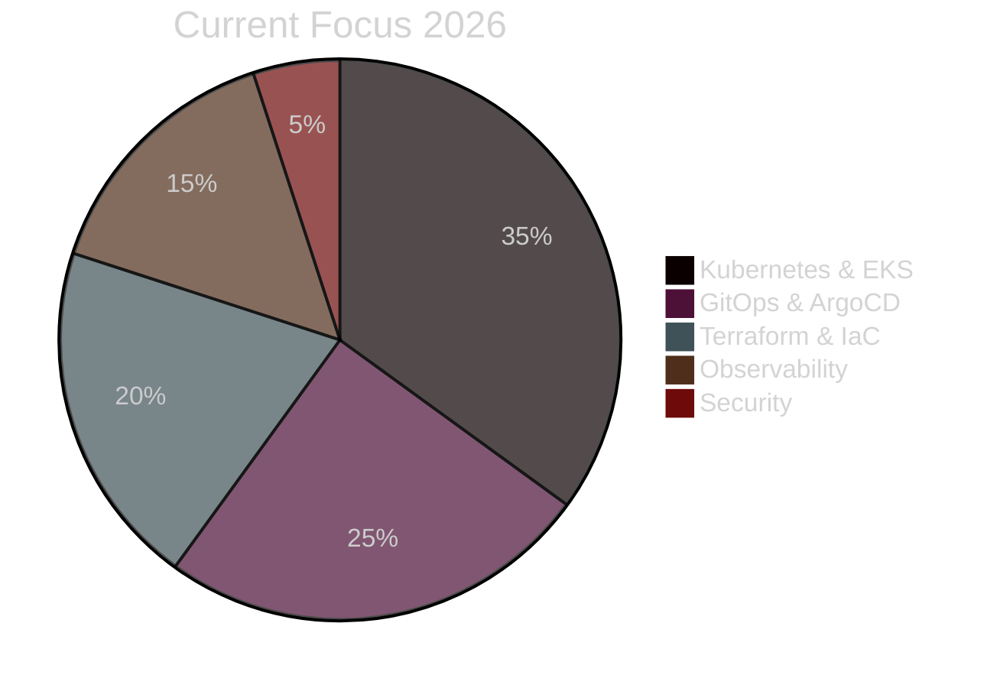

<!-- ANIMATED HEADER WITH WAVE -->
<div align="center">
  
</div>

<!-- SNAKE EATING CONTRIBUTIONS -->
<div align="center">
  <picture>
    <source media="(prefers-color-scheme: dark)" srcset="https://raw.githubusercontent.com/MohamedElsayad5/MohamedElsayad5/output/github-contribution-grid-snake-dark.svg">
    <source media="(prefers-color-scheme: light)" srcset="https://raw.githubusercontent.com/MohamedElsayad5/MohamedElsayad5/output/github-contribution-grid-snake.svg">
    
  </picture>
</div>

<!-- DYNAMIC TYPING WITH EMOJIS -->
<div align="center">
  <a href="https://git.io/typing-svg">
    
  </a>
</div>

<!-- ANIMATED COUNTERS -->
<div align="center">
  
[[Profile Views](https://visitcount.itsvg.in/api?id=MohamedElsayad5&label=Profile%20Views&color=12&icon=5&pretty=true)](https://visitcount.itsvg.in)
[[Followers](https://img.shields.io/github/followers/MohamedElsayad5?label=Followers&style=for-the-badge&color=00F7FF&logo=github)](https://github.com/MohamedElsayad5)
[[Location](https://img.shields.io/badge/Cairo-Egypt-red?style=for-the-badge&logo=googlemaps&logoColor=white)](https://)

</div>


<!-- ABOUT ME WITH ANIMATED CODING GIF -->
##  About Me


```yaml
Name: Mohamed Elsayad
Location: Cairo, Egypt 🇪🇬
Role: DevOps & Cloud Engineer
Education: Electrical & Communication Engineering

Core_Skills:
  Cloud: [AWS, Kubernetes, OpenShift, Azure]
  IaC: [Terraform, Ansible, Helm]
  CI/CD: [GitHub Actions, Jenkins, ArgoCD, GitLab CI]
  Containers: [Docker, containerd, Podman]
  Monitoring: [Prometheus, Grafana, ELK Stack]
  Scripting: [Python, Go, Bash, PowerShell]
  Networking: [CCNA Level, VPC, Load Balancers]
  Systems: [Linux Admin, Windows Server]

Current_Mission:
    - Building production-grade K8s clusters on AWS EKS
    - Implementing GitOps workflows with ArgoCD
    - Automating everything with Terraform & Ansible
    - Achieving 99.99% uptime with proper observability

Fun_Fact: I troubleshoot in production faster than I make coffee ☕
```

<br>


##  Tech Stack

<div align="center">

### ☁️ Cloud & Orchestration
[Kubernetes](https://img.shields.io/badge/Kubernetes-326CE5?style=for-the-badge&logo=kubernetes&logoColor=white&labelColor=0d1117)
[Docker](https://img.shields.io/badge/Docker-2496ED?style=for-the-badge&logo=docker&logoColor=white&labelColor=0d1117)
[AWS](https://img.shields.io/badge/Amazon_AWS-232F3E?style=for-the-badge&logo=amazonaws&logoColor=white&labelColor=0d1117)
[OpenShift](https://img.shields.io/badge/OpenShift-EE0000?style=for-the-badge&logo=redhatopenshift&logoColor=white&labelColor=0d1117)
[Azure](https://img.shields.io/badge/Azure-0078D4?style=for-the-badge&logo=microsoftazure&logoColor=white&labelColor=0d1117)

### ⚙️ Infrastructure & Automation
[Terraform](https://img.shields.io/badge/Terraform-7B42BC?style=for-the-badge&logo=terraform&logoColor=white&labelColor=0d1117)
[Ansible](https://img.shields.io/badge/Ansible-EE0000?style=for-the-badge&logo=ansible&logoColor=white&labelColor=0d1117)
[Helm](https://img.shields.io/badge/Helm-0F1689?style=for-the-badge&logo=helm&logoColor=white&labelColor=0d1117)
[ArgoCD](https://img.shields.io/badge/ArgoCD-EF7B4D?style=for-the-badge&logo=argo&logoColor=white&labelColor=0d1117)

### 🔄 CI/CD & Version Control
[GitHub Actions](https://img.shields.io/badge/GitHub_Actions-2088FF?style=for-the-badge&logo=github-actions&logoColor=white&labelColor=0d1117)
[Jenkins](https://img.shields.io/badge/Jenkins-D24939?style=for-the-badge&logo=jenkins&logoColor=white&labelColor=0d1117)
[GitLab CI](https://img.shields.io/badge/GitLab_CI-FC6D26?style=for-the-badge&logo=gitlab&logoColor=white&labelColor=0d1117)
[Git](https://img.shields.io/badge/Git-F05032?style=for-the-badge&logo=git&logoColor=white&labelColor=0d1117)

### 💻 Languages
[Python](https://img.shields.io/badge/Python-3776AB?style=for-the-badge&logo=python&logoColor=white&labelColor=0d1117)
[Go](https://img.shields.io/badge/Go-00ADD8?style=for-the-badge&logo=go&logoColor=white&labelColor=0d1117)
[Bash](https://img.shields.io/badge/Bash-4EAA25?style=for-the-badge&logo=gnu-bash&logoColor=white&labelColor=0d1117)
[YAML](https://img.shields.io/badge/YAML-CB171E?style=for-the-badge&logo=yaml&logoColor=white&labelColor=0d1117)

### 📊 Monitoring & Observability
[Prometheus](https://img.shields.io/badge/Prometheus-E6522C?style=for-the-badge&logo=prometheus&logoColor=white&labelColor=0d1117)
[Grafana](https://img.shields.io/badge/Grafana-F46800?style=for-the-badge&logo=grafana&logoColor=white&labelColor=0d1117)
[ElasticSearch](https://img.shields.io/badge/ElasticSearch-005571?style=for-the-badge&logo=elasticsearch&logoColor=white&labelColor=0d1117)

### 🗄️ Databases & OS
[PostgreSQL](https://img.shields.io/badge/PostgreSQL-316192?style=for-the-badge&logo=postgresql&logoColor=white&labelColor=0d1117)
[Redis](https://img.shields.io/badge/Redis-DC382D?style=for-the-badge&logo=redis&logoColor=white&labelColor=0d1117)
[Linux](https://img.shields.io/badge/Linux-FCC624?style=for-the-badge&logo=linux&logoColor=black&labelColor=0d1117)
[Ubuntu](https://img.shields.io/badge/Ubuntu-E95420?style=for-the-badge&logo=ubuntu&logoColor=white&labelColor=0d1117)

</div>


##  Featured Projects

<div align="center">
<table>
<tr>
<td width="50%">
<h3 align="center">🚀 EKS Production Platform</h3>
<div align="center">  

<br>
<p>
<a href="#"></a>
<a href="#"></a>
<a href="#"></a>
</p>
<p><strong>Highly Available K8s on AWS</strong><br>Multi-AZ cluster with auto-scaling, service mesh, and full observability stack</p>
</div>
</td>
<td width="50%">
<h3 align="center">⚡ Zero-Downtime CI/CD</h3>
<div align="center">

<br>
<p>
<a href="#"></a>
<a href="#"></a>
<a href="#"></a>
</p>
<p><strong>Commit to Production in 5 Minutes</strong><br>Automated testing, security scanning, and blue-green deployments</p>
</div>
</td>
</tr>
<tr>
<td width="50%">
<h3 align="center">🏗️ Infrastructure as Code</h3>
<div align="center">

<br>
<p>
<a href="#"></a>
<a href="#"></a>
<a href="#"></a>
</p>
<p><strong>100% Automated Infrastructure</strong><br>Complete VPC, EKS, RDS, and networking provisioned via code</p>
</div>
</td>
<td width="50%">
<h3 align="center">📊 Observability Stack</h3>
<div align="center">

<br>
<p>
<a href="#"></a>
<a href="#"></a>
<a href="#"></a>
</p>
<p><strong>Full Stack Monitoring</strong><br>Metrics, logs, traces with automated alerting and dashboards</p>
</div>
</td>
</tr>
</table>
</div>


##  GitHub Analytics

<div align="center">
   
  
</div>

<div align="center">
  
</div>

<!-- 3D CONTRIBUTION GRAPH -->
<div align="center">
  
</div>

<!-- CONTRIBUTION ACTIVITY GRAPH -->
<div align="center">
  
</div>


##  Current Status

<div align="center">



</div>

```diff
+ 🔭 Working On:    Production EKS with Istio Service Mesh
+ 🌱 Learning:      CKA Certification + Advanced K8s Security
+ 👯 Looking For:   Collaborate on Open Source DevOps Tools
+ 💬 Ask Me About:  Docker, K8s, AWS, Terraform, CI/CD, Linux
+ ⚡ Fun Fact:      I can kubectl debug a CrashLoopBackOff in my sleep
+ 🎯 2026 Goals:    CKA + AWS Solutions Architect Pro
+ 📍 Location:      Cairo, Egypt 🇪🇬
```


## 🏆 GitHub Trophies
<div align="center">
  
</div>


##  Let's Connect

<div align="center">
  
<a href="https://linkedin.com/in/mohamed-mahamoud-elsayad" target="_blank">
  
</a>
<a href="mailto:moeyelsayad777@gmail.com" target="_blank">
  
</a>
<a href="https://github.com/MohamedElsayad5" target="_blank">
  
</a>

</div>

<!-- ANIMATED FOOTER WAVE -->
<div align="center">
  
</div>

<div align="center">
  
  <br><br>
  <b>“Automate everything. Monitor everything. Scale everything. Sleep peacefully.” ⚙️</b>
  <br><br>
  
</div>